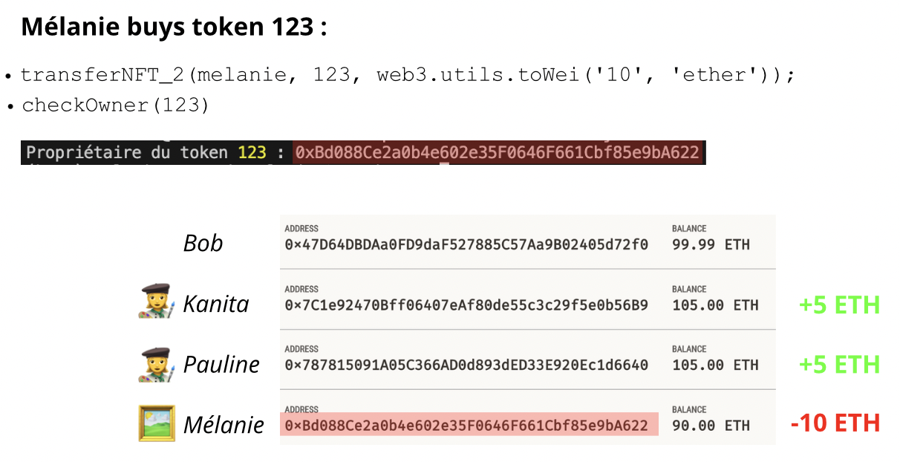
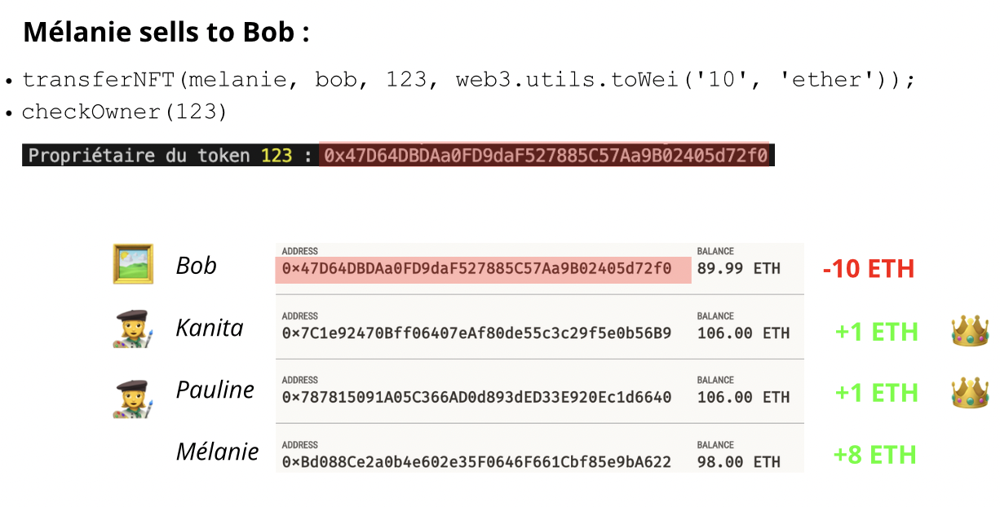

In collaboration with Kanita Loisy and Pauline Spinga, I delved into a project focusing on the application of blockchain technology in royalty management for the course "Digital Content Protection" . As the digitization of resources continues to proliferate, the need for robust protection mechanisms has become increasingly apparent. Our project aimed to explore how blockchain could revolutionize the management of intellectual property rights, particularly in the realm of visual content.

## Understanding Blockchain and Its Application in Royalty Management

### Definition and Objectives:

- **Blockchain**: A decentralized and secure network of nodes (computers) that generates cryptographically linked immutable data blocks, serving as a digital ledger.
- **Smart Contracts**: Pieces of computer code, automated and immutable, acting as engines of decentralized applications offering various services, such as decentralized finance and marketplaces.
- **Tokens**: Represent value and digital assets on the blockchain, including transactional tokens (e.g., Gas on the Ethereum network) and user-created tokens (e.g., Ethereum, Bitcoin).
- **Solution Offered by Blockchains**: Facilitates decentralized ownership and licensing models through tokenization, providing a secure and transparent way to transfer and manage content rights.

## Implementation

### Sharing Rights on an Artwork:

- **Overview**: Consideration of an asset (painting, picture) that can be created by one or multiple artists. Each artist owns cuts, and tokens are associated to represent the right of access to the asset.
- **Implementation Details**: 
  - Utilization of Ethereum blockchain, with NFTs used to represent non-divisible assets like pictures.
  - Deployment of smart contracts in Solidity language, enabling the creation, transfer, and ownership of tokens representing rights to artistic assets.
  - Tools such as Ganache, Truffle, and Web3.js utilized for development and interaction with the smart contract.
  
- **Ganache**: Ethereum blockchain simulator
- **Solidity**: Programming language for smart contracts
- **Truffle**: Ethereum development framework
- **Web3.js**: Library for interacting with Ethereum node

## Illustration: Implementation Results

Our project implementation resulted in significant insights into how blockchain can streamline royalty management. Here's a breakdown of the process illustrated with examples:

### Initial Accounts and Token Distribution

The initial setup depicts fictive accounts on Ganache for Kanita and Pauline (artists) as well as Bob and Mélanie (not artists). Two tokens are created and distributed (id : 123 and 456) for Kanita's and Pauline's work of art, with a 50/50 share between two artists.

### Mélanie Buying Token 123

Mélanie purchases Token 123, resulting in changes in account balances. The artists receive 5 ETH each, while Mélanie's account decreases by 10 ETH.

### Mélanie Selling Token to Bob

Mélanie sells Token 123 to Bob, resulting in royalties for the artists. The transaction details indicate amounts exchanged between parties.

## Conclusion

In conclusion, protecting visual content and managing royalties can be challenging. However, the integration of blockchain technology presents a promising solution to overcome these challenges. Blockchain offers transparent, tamper-proof, and traceable transactions. The introduction of non-fungible tokens (NFTs) enables the representation of unique assets and the management of intellectual property rights. Through our implementation on the Ethereum blockchain, we have explored the creation, transfer, and ownership of tokens representing rights to artistic assets. Additionally, we have addressed the sharing of rights on artwork and the distribution of royalties.