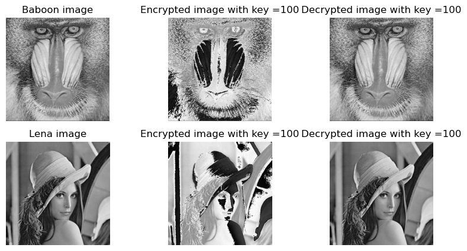
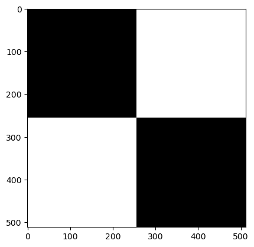
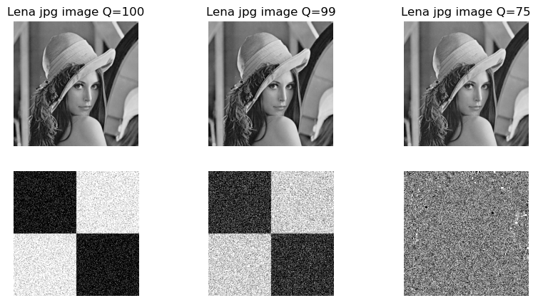

| Name       | Course  | Date       |
|------------|--------------|------------|
| Mélanie Brégou  | Digital content protection | 06/10/2023|

**Objective :** delve into image encryption and steganography, exploring classical ciphers and digital techniques.

### Table of Contents
- [CAESAR cipher](#caesar-cypher-applied-to-images)
- [Simple substitution cipher](#simple-substitution-cipher-applied-to-images)
- [Simple transposition cipher](#simple-transposition-cipher-applied-to-images)
- [LSB (lowest significant bit) steganography](#lsb-lowest-significant-bit-steganography)
- [Image compression in JPG](#image-compression-in-jpg)
- [Image compression in PNG](#image-compression-in-png)
- [LSB with 2 significant bit](#lsb-with-2-significant-bit)


```python
from matplotlib import image
import matplotlib.pyplot as plt 
import numpy as np
import random
from PIL import Image
```

Firstly, let's display the images used for this lab.


```python
baboon = image.imread("../TP-HTI/baboon.jpg")
lena = image.imread("../TP-HTI/lena.jpg")

fig, axes = plt.subplots(1, 2, figsize=(8, 4))
axes[0].imshow(baboon, cmap='gray')
axes[0].set_title("Baboon image")
axes[1].imshow(lena, cmap='gray')
axes[1].set_title("Lena image")

for ax in axes:
    ax.axis('off')
plt.show()
```


    

    


## CAESAR cypher applied to images

CAESAR encryption applied to images involves shifting each pixel's intensity by a fixed key value, with encryption adding the key and decryption subtracting it.


```python
def encrypt(image,key):
    encrypted = np.zeros(image.shape)
    for i in range(image.shape[0]):
        for j in range(image.shape[1]):
            pixel = image[i][j]
            encrypted[i][j] = (pixel + key) % 256  
            
    return encrypted


def decrypt(image,key):
    decrypted = np.zeros(image.shape)
    for i in range(image.shape[0]):
        for j in range(image.shape[1]):
            pixel = image[i][j]
            decrypted[i][j] = (pixel - key) % 256  
            
    return decrypted
```


```python
keys = [50,100,150,200]

for key in keys :

    encrypt_baboon = encrypt(baboon, key)
    encrypt_lena = encrypt(lena,key)
    decrypt_baboon = decrypt(encrypt_baboon, key)
    decrypt_lena = decrypt(encrypt_lena,key)

    fig, axes = plt.subplots(2, 3, figsize=(10, 5))
    axes[0][0].imshow(baboon, cmap='gray')
    axes[0][0].set_title(f"Baboon image")
    axes[0][1].imshow(encrypt_baboon, cmap='gray')
    axes[0][1].set_title(f"Encrypted image with key ={key}")
    axes[0][2].imshow(decrypt_baboon, cmap='gray')
    axes[0][2].set_title(f"Decrypted image with key ={key}")
    axes[1][0].imshow(lena, cmap='gray')
    axes[1][0].set_title(f"Lena image")
    axes[1][1].imshow(encrypt_lena, cmap='gray')
    axes[1][1].set_title(f"Encrypted image with key ={key}")
    axes[1][2].imshow(decrypt_lena, cmap='gray')
    axes[1][2].set_title(f"Decrypted image with key ={key}")

    for row in axes:
        for ax in row:
            ax.axis('off')
plt.show()
```


    

    


    

    


    

    


    

    


The encrypted image remains recognizable, regardless of the key value. This suggests a significant limitation of the Caesar cipher for image encryption as it lacks the ability to effectively obscure the content and is highly vulnerable to attacks.

## Simple substitution cipher applied to images

Substitution cipher involves changing each pixel's value in an image by mapping it to a predefined shuffled list during encryption and back to the original value during decryption


```python
values = np.arange(255)
random.shuffle(values)
shuffled_values_list = values.tolist()
```


```python
def encrypt_substitution(image,shuffled_values_list):
    encrypted = np.zeros(image.shape)
    for i in range(image.shape[0]):
        for j in range(image.shape[1]):
            pixel = image[i][j]
            encrypted[i][j] =  shuffled_values_list[pixel]      
    return encrypted


def decrypt_substitution(image,shuffled_values_list):
    decrypted = np.zeros(image.shape)
    for i in range(image.shape[0]):
        for j in range(image.shape[1]):
            pixel = image[i][j]
            decrypted[i][j] =  shuffled_values_list.index(pixel)          
    return decrypted
```


```python
encrypt_substitution_lena = encrypt_substitution(lena,shuffled_values_list)
decrypt_substitution_lena = decrypt_substitution(encrypt_substitution_lena,shuffled_values_list)

fig, axes = plt.subplots(1, 3, figsize=(10, 5))
axes[0].imshow(lena, cmap='gray')
axes[0].set_title(f"Lena image")
axes[1].imshow(encrypt_substitution_lena, cmap='gray')
axes[1].set_title(f"Encrypted image")
axes[2].imshow(decrypt_substitution_lena, cmap='gray')
axes[2].set_title(f"Decrypted image")

for ax in axes:
    ax.axis('off')
```


    

    


The encrypted image is less visible than Caesar encryption but the general shape is still recognizable.

## Simple transposition cipher applied to images

In simple transposition cipher, pixel positions are shuffled using random row and column permutations. This process includes encrypting the original image by rearranging pixel positions and then decrypting it to recover the original image.


```python
rows = np.arange(512)
columns = np.arange(512)
random.shuffle(rows)
random.shuffle(columns)

shuffled_rows_list = rows.tolist()
shuffled_columns_list = columns.tolist()
```


```python
def encrypt_transposition(image,shuffled_rows_list,shuffled_columns_list):
    encrypted = np.zeros(image.shape)
    for i in range(image.shape[0]):
        for j in range(image.shape[1]):
            key_i =  shuffled_rows_list[i]
            key_j = shuffled_columns_list[j]
            encrypted[i][j] =  image[key_i][key_j]    
    return encrypted

def decrypt_transposition(image,shuffled_rows_list,shuffled_columns_list):
    decrypted = np.zeros(image.shape)
    for i in range(image.shape[0]):
        for j in range(image.shape[1]):
            original_i = shuffled_rows_list.index(i) 
            original_j = shuffled_columns_list.index(j)   
            decrypted[i][j] =  image[original_i][original_j]              
    return decrypted
```


```python
encrypt_transposition_lena = encrypt_transposition(lena,shuffled_rows_list,shuffled_columns_list)
decrypt_transposition_lena = decrypt_transposition(encrypt_transposition_lena,shuffled_rows_list,shuffled_columns_list)

fig, axes = plt.subplots(1, 3, figsize=(10, 5))
axes[0].imshow(lena, cmap='gray')
axes[0].set_title(f"Lena image")
axes[1].imshow(encrypt_transposition_lena, cmap='gray')
axes[1].set_title(f"Encrypted image")
axes[2].imshow(decrypt_transposition_lena, cmap='gray')
axes[2].set_title(f"Decrypted image")


for ax in axes:
    ax.axis('off')
```


    

    


Lena is now well hidden in the encrypted image !

## LSB (lowest significant bit) steganography

In LSB (Least Significant Bit) steganography, the process involves hiding information in an image by manipulating the least significant bits of the pixel values. 


```python
lena_lsb_00 = lena[:256,:256] - lena[:256,:256]%2
lena_lsb_01 = lena[:256,256:] - lena[:256,256:]%2 +1
lena_lsb_10 = lena[256:,:256] - lena[256:,:256]%2 +1
lena_lsb_11 = lena[256:,256:] - lena[256:,256:]%2

fig, axes = plt.subplots(2, 2, figsize=(5, 5))
axes[0][0].imshow(lena_lsb_00, cmap='gray')
axes[0][1].imshow(lena_lsb_01, cmap='gray')
axes[1][0].imshow(lena_lsb_10, cmap='gray')
axes[1][1].imshow(lena_lsb_11, cmap='gray')


for row in axes:
    for ax in row:
        ax.axis('off')
```


    

    


```python
lena_lsb = np.zeros((512,512))

lena_lsb[:256,:256]= lena_lsb_00
lena_lsb[:256,256:] = lena_lsb_01
lena_lsb[256:,:256] = lena_lsb_10
lena_lsb[256:,256:] = lena_lsb_11


fig, axes = plt.subplots(1, 2, figsize=(10, 5))


axes[0].imshow(lena, cmap='gray')
axes[0].set_title(f"Lena image")
axes[1].imshow(lena_lsb, cmap='gray')
axes[1].set_title(f"Lena LSB image")

for ax in axes :
    ax.axis('off')
```


    

    


```python
lena_decoded =  lena_lsb %2
plt.imshow(lena_decoded, cmap='gray')
```


    <matplotlib.image.AxesImage at 0x12ace1a50>


    

    


By creating four versions of the image "lena" (lena_lsb_00, lena_lsb_01, lena_lsb_10, lena_lsb_11) the least significant bit in different regions is altered. These regions hide binary information without significantly altering the global visual appearance and the hidden information can be decoded.

Let's examine image compression in JPG and PNG and its consequences on the quality of the transmitted information.

### Image compression in JPG

Image compression


```python
img_lena_lsb = Image.fromarray(lena_lsb)
img_lena_lsb = img_lena_lsb.convert("L")
img_lena_lsb.save('./lena_lsb_100.jpg', optimize=True, quality=100)
img_lena_lsb.save('./lena_lsb_99.jpg', optimize=True, quality=99)
img_lena_lsb.save('./lena_lsb_75.jpg', optimize=True, quality=75)
```

Compressed image and decoded information display


```python
lena_lsb_100 = image.imread("./lena_lsb_100.jpg")
lena_lsb_99 = image.imread("./lena_lsb_99.jpg")
lena_lsb_75 = image.imread("./lena_lsb_75.jpg")

fig, axes = plt.subplots(2, 3, figsize=(10, 5))
axes[0][0].imshow(lena_lsb_100, cmap='gray')
axes[0][0].set_title(f"Lena jpg image Q=100")
axes[0][1].imshow(lena_lsb_99, cmap='gray')
axes[0][1].set_title(f"Lena jpg image Q=99")
axes[0][2].imshow(lena_lsb_75, cmap='gray')
axes[0][2].set_title(f"Lena jpg image Q=75")

lena_decoded_100 = lena_lsb_100 %2
lena_decoded_99 = lena_lsb_99%2
lena_decoded_75 = lena_lsb_75%2

axes[1][0].imshow(lena_decoded_100, cmap='gray')
axes[1][1].imshow(lena_decoded_99, cmap='gray')
axes[1][2].imshow(lena_decoded_75, cmap='gray')


for row in axes:
    for ax in row:
        ax.axis('off')
```


    

    


The compression has no visual effet on the Lena image but deteriorates the transmitted information. 

### Image compression in PNG

Image compression


```python
img_lena_lsb = Image.fromarray(lena_lsb)
img_lena_lsb = img_lena_lsb.convert("L")
img_lena_lsb.save('./lena_lsb_9.png', optimize=True, quality= 9)
img_lena_lsb.save('./lena_lsb_7.png', optimize=True, quality=7)
img_lena_lsb.save('./lena_lsb_5.png', optimize=True, quality=5)

```

Compressed image and decoded information display


```python
lena_lsb_100_png = image.imread("./lena_lsb_9.png")
lena_lsb_99_png = image.imread("./lena_lsb_7.png")
lena_lsb_75_png = image.imread("./lena_lsb_5.png")

fig, axes = plt.subplots(2, 3, figsize=(10, 5))
axes[0][0].imshow(lena_lsb_100_png, cmap='gray')
axes[0][0].set_title(f"Lena png image Q=9")
axes[0][1].imshow(lena_lsb_99_png, cmap='gray')
axes[0][1].set_title(f"Lena png image Q=7")
axes[0][2].imshow(lena_lsb_75_png, cmap='gray')
axes[0][2].set_title(f"Lena png image Q=5")

lena_decoded_100_png = (lena_lsb_100_png * 255).astype(np.uint8) % 2
lena_decoded_99_png = (lena_lsb_99_png * 255).astype(np.uint8) % 2
lena_decoded_75_png = (lena_lsb_75_png * 255).astype(np.uint8) % 2

axes[1][0].imshow(lena_decoded_100_png, cmap='gray')
axes[1][1].imshow(lena_decoded_99_png, cmap='gray')
axes[1][2].imshow(lena_decoded_75_png, cmap='gray')

for row in axes:
    for ax in row:
        ax.axis('off')
```


    

    


The PNG compression has no effect on the Lena image and does not impact the transmitted information !

### LSB with 2 significant bit

In LSB with 2 significant bits steganography, information is hidden within the image by altering the two least significant bits of pixel values.


```python
lena_lsb2_00 = lena[:256,:256] - lena[:256,:256]%4
lena_lsb2_01 = lena[:256,256:] - lena[:256,256:]%4 +1
lena_lsb2_10 = lena[256:,:256] - lena[256:,:256]%4 +2
lena_lsb2_11 = lena[256:,256:] - lena[256:,256:]%4 +3


fig, axes = plt.subplots(2, 2, figsize=(5, 5))
axes[0][0].imshow(lena_lsb2_00, cmap='gray')
axes[0][1].imshow(lena_lsb2_01, cmap='gray')
axes[1][0].imshow(lena_lsb2_10, cmap='gray')
axes[1][1].imshow(lena_lsb2_11, cmap='gray')

for row in axes:
    for ax in row:
        ax.axis('off')
```


    

    


```python
lena_lsb2 = np.zeros((512,512))
lena_lsb2[:256,:256]= lena_lsb2_00
lena_lsb2[:256,256:] = lena_lsb2_01
lena_lsb2[256:,:256] = lena_lsb2_10
lena_lsb2[256:,256:] = lena_lsb2_11

fig, axes = plt.subplots(1, 2, figsize=(10, 5))
axes[0].imshow(lena, cmap='gray')
axes[0].set_title(f"Lena image")
axes[1].imshow(lena_lsb2, cmap='gray')
axes[1].set_title(f"Lena 2bit-LSB image")

for ax in axes:
    ax.axis('off')
```


    

    


The information added has no visual effect on Lena ...


```python
lena2_decoded =  lena_lsb2 %4
plt.imshow(lena2_decoded, cmap='gray')
plt.axis('off')
```


    (-0.5, 511.5, 511.5, -0.5)


    

    


... but can be effectively decrypted !

## Conclusion

CAESAR cipher doesn't provide privacy of the image content as well as simple substitution. However, simple transposition ensure privacy for the image content.
Furthermore, information can be concealed in images with LSB technique (single or two significant bit). But the use of JPG compression may impact the quality of the decoded information.
