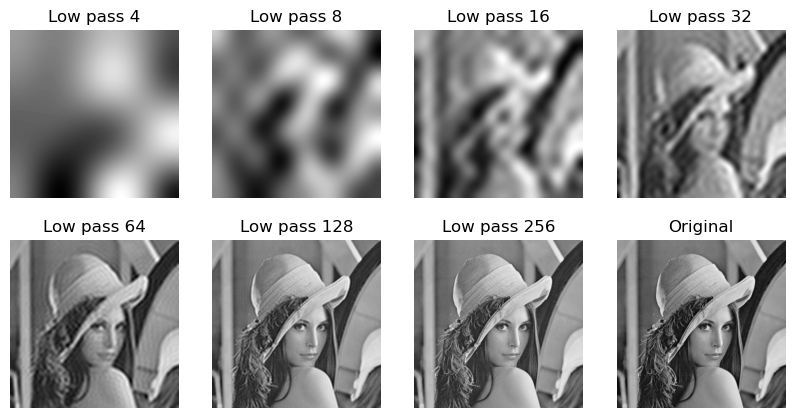
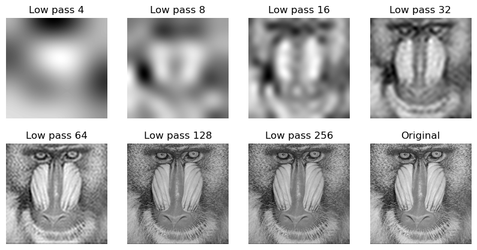
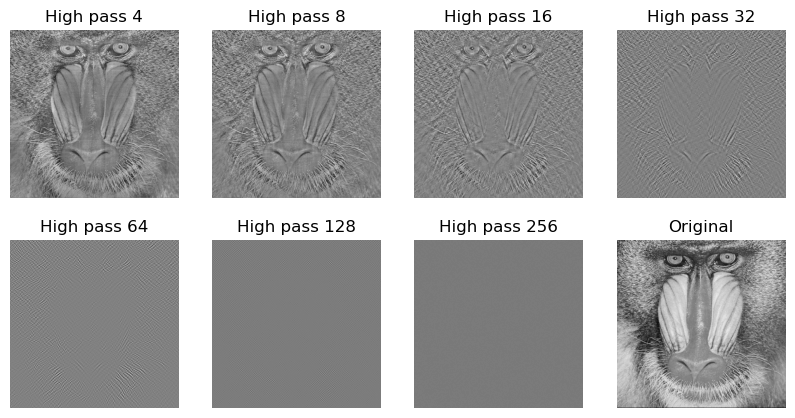

| Name       | Course  | Date       |
|------------|--------------|------------|
| Mélanie Brégou  | Digital content protection | 13/10/2023|


**Objective :** relate the transform representation and its visual impact


### Table of Contents
- [Compute the 2D-DCT for the images](#compute-the-2d-dct-for-the-images)
- [Low pass filtering](#low-pass-filtering)
- [High pass filtering](#high-pass-filtering)
- [Illustrating how the spatial DCT frequencies are related the visual content](#illustrating-how-the-spatial-dct-frequencies-are-related-the-visual-content)

### Compute the 2D-DCT for the images 

The Two-Dimensional Discrete Cosine Transform is a mathematical operation applied in image processing to represent images in a frequency domain. This transformation is a pivotal tool for analyzing the spatial characteristics of images, allowing the separation of high-frequency components (edges or fine details) from low-frequency components  (smooth transitions and gradual changes). 


```python
import cv2
import numpy as np
import matplotlib.pyplot as plt 
import os
```

Let's calculate and save to results folder the DCT of Lena and baboon images. 


```python
results_dir = "./results"

if not os.path.exists(results_dir):
    os.makedirs(results_dir)


lena = cv2.imread("../TP-HTI/lena.jpg", 0)
lena_f = np.float32(lena)
dct_lena = cv2.dct(lena_f)
cv2.imwrite("./results/lena_dct.jpg", dct_lena)


baboon = cv2.imread("../TP-HTI/baboon.jpg", 0)
baboon_f = np.float32(baboon)
dct_baboon = cv2.dct(baboon_f)
cv2.imwrite("./results/baboon_dct.jpg", dct_baboon)

```


    True


Now let's apply the Inverse Discrete Cosine Transform (IDCT) which is the reverse process of the DCT : It converts frequency domain representations back into the original spatial domain.


```python
idct_lena = cv2.idct(dct_lena)
idct_lena = np.uint8(idct_lena)
cv2.imwrite("./results/lena_idct.jpg", idct_lena)

idct_baboon = cv2.idct(dct_baboon)
idct_baboon  = np.uint8(idct_baboon )
cv2.imwrite("./results/baboon_idct.jpg", idct_baboon )

```


    True


```python
diff_lena = lena - dct_lena
diff_baboon = baboon -dct_baboon
print(f"The difference between lena and IDCT lena is {np.max(diff_lena)} for the maximal absolute and {np.min(diff_lena)} for the minimal absolute value. ")

print(f"The difference between baboon and IDCT baboon is {np.max(diff_baboon)} for the maximal absolute and {np.min(diff_baboon)} for the minimal absolute value. ")
```

    The difference between lena and IDCT lena is 5380.279296875 for the maximal absolute and -63353.06640625 for the minimal absolute value. 
    The difference between baboon and IDCT baboon is 4685.52001953125 for the maximal absolute and -65976.203125 for the minimal absolute value. 


```python

image_dct_lena = cv2.imread("./results/baboon_dct.jpg",0)
print(np.max(image_dct_lena))

plt.imshow(image_dct_lena, cmap='gray')
```

    255


    <matplotlib.image.AxesImage at 0x1792de1d0>


    

    


```python
fig, axes = plt.subplots(2, 3, figsize=(10, 5))
image_dct_lena = cv2.imread("./results/lena_dct.jpg",0)
image_dct_baboon = cv2.imread("./results/baboon_dct.jpg",0)

axes[0][0].imshow(lena, cmap='gray')
axes[0][0].set_title("Lena image")

axes[0][1].imshow(image_dct_lena, cmap='gray')
axes[0][1].set_title("Lena DCT image")

axes[0][2].imshow(idct_lena, cmap='gray')
axes[0][2].set_title("Lena IDCT image")

axes[1][0].imshow(baboon, cmap='gray')
axes[1][0].set_title("Baboon image")

axes[1][1].imshow(image_dct_baboon, cmap='gray')
axes[1][1].set_title("Baboon DCT image")

axes[1][2].imshow(idct_baboon, cmap='gray')
axes[1][2].set_title("Baboon IDCT image")

for ax in axes:
    for row in ax :
        row.axis('off')
```


    

    


The upper-left corner of the DCT images contains lower-frequency components, representing smoother variations in the original images, such as gradual changes in intensity. Conversely, the lower-right corner contains higher-frequency components, which capture fine details, edges, and rapid transitions. As the Baboon image has more texture, its DCT representation contains more white pixels outside the top left-hand corner.

After applying IDCT, the images are reconstructed from their frequency components. However, the reconstructed images exhibit differences due to the inevitable loss of information during the DCT transformation and subsequent IDCT reconstruction. Notably, the maximal and minimal absolute differences with the original images reveal imperceptible deteriorations, highlighting the subtle information loss in the transformation process.

### Low pass filtering

In this section, we examine the impact of low-pass filtering on our image reconstruction using a low pass filter before performing the IDCT. By varying the cutoff frequency of the filter, we can observe how different levels of filtering influence the reconstructed images. 


```python
cf_list = [2**i for i in range (2, 9)]
```


```python
def low_pass_filter(img,fc):
    img_f = np.float32(img)
    img_dct = cv2.dct(img_f)
    img_dct_lp = np.zeros(img.shape)
    img_dct_lp[:fc,:fc] = img_dct[:fc,:fc]
    img_idct_lp = cv2.idct(img_dct_lp)
    img_idct_lp = np.uint8(img_idct_lp)
    return img_idct_lp

```


```python
fig, axes = plt.subplots(2, 4, figsize=(10, 5))
fig2,axes2 = plt.subplots(2, 4, figsize=(10, 5))

for i, fc in enumerate(cf_list) :
    lena_idct_lp = low_pass_filter(lena,fc)
    cv2.imwrite(f"./results/lena_idct_lp_fc_{fc}.jpg", lena_idct_lp)
    axes[i // 4, (i % 4) ].imshow(lena_idct_lp, cmap='gray')
    axes[i // 4, (i % 4)].set_title(f"Low pass {fc}")

    baboon_idct_lp = low_pass_filter(baboon,fc)
    cv2.imwrite(f"./results/baboon_idct_lp_fc_{fc}.jpg", baboon_idct_lp)
    axes2[i // 4, (i % 4) ].imshow(baboon_idct_lp, cmap='gray')
    axes2[i // 4, (i % 4)].set_title(f"Low pass {fc}")


axes[1][3].imshow(lena, cmap='gray')
axes[1][3].set_title(f"Original")
axes2[1][3].imshow(baboon, cmap='gray')
axes2[1][3].set_title(f"Original")

for row in axes:
    for ax in row:
        ax.axis('off')
for row in axes2:
    for ax in row:
        ax.axis('off')
```


    

    


    

    


A low-pass filter allows only lower-frequency components to pass through, smoothing the details of the image. 
Baboon image has more texture than Lena image and its general shape is less detectable than lena at really low fc.

### High pass filtering


```python
def high_pass_filter(img,fc):
    img_f = np.float32(img)
    img_dct = cv2.dct(img_f)
    img_dct_hp = np.zeros(img.shape)
    high_freq = img_dct[fc:,fc:]
    constant =  img_dct[0][0]
    img_dct_hp[fc:,fc:] = high_freq
    img_dct_hp[0][0]= constant
    img_idct_hp = cv2.idct(img_dct_hp)
    img_idct_hp = np.uint8(img_idct_hp)
    return img_idct_hp

```


```python
fig, axes = plt.subplots(2, 4, figsize=(10, 5))
fig2,axes2 = plt.subplots(2, 4, figsize=(10, 5))

for i, fc in enumerate(cf_list) :
    lena_idct_hp = high_pass_filter(lena,fc)

    cv2.imwrite(f"./results/lena_idct_hp_fc_{fc}.jpg", lena_idct_hp)
    axes[i // 4, (i % 4) ].imshow(lena_idct_hp, cmap='gray')
    axes[i // 4, (i % 4)].set_title(f"High pass {fc}")

    baboon_idct_hp = high_pass_filter(baboon,fc)
    cv2.imwrite(f"./results/baboon_idct_hp_fc_{fc}.jpg", baboon_idct_hp)
    axes2[i // 4, (i % 4) ].imshow(baboon_idct_hp, cmap='gray')
    axes2[i // 4, (i % 4)].set_title(f"High pass {fc}")


axes[1][3].imshow(lena, cmap='gray')
axes[1][3].set_title(f"Original")
axes2[1][3].imshow(baboon, cmap='gray')
axes2[1][3].set_title(f"Original")

for row in axes:
    for ax in row:
        ax.axis('off')
for row in axes2:
    for ax in row:
        ax.axis('off')
```


    

    


    

    


The high pass filtering emphasizes the finer details and edge of the images such as the fur of the baboon. However, when the cutoff frequency (fc) is too high, it leads to significant information loss in the images and the filtered images may appear mostly gray. 

###  Illustrating how the spatial DCT frequencies are related the visual content


```python
def combined_image(image_lf, image_hf, fc):
    image_lf = np.float32(image_lf)
    image_hf = np.float32(image_hf)
    dct_lf = cv2.dct(image_lf)
    dct_hf = cv2.dct(image_hf)
    dct_lf[fc:, fc:] = dct_hf[fc:, fc:]
    return cv2.idct(dct_lf)

lena_baboon_32 = combined_image(lena,baboon,32)
plt.imshow(lena_baboon_32, cmap='gray')
plt.axis('off')
plt.show()
```


    

    


```python
fig, axes = plt.subplots(2, 4, figsize=(10, 5))
fig2,axes2 = plt.subplots(2, 4, figsize=(10, 5))

for i, fc in enumerate(cf_list) :
    lena_baboon = combined_image(lena,baboon,fc)

    cv2.imwrite(f"./results/lena_baboon_{fc}.jpg", lena_baboon)
    axes[i // 4, (i % 4) ].imshow(lena_baboon, cmap='gray')
    axes[i // 4, (i % 4)].set_title(f"Lena Baboon {fc}")

    baboon_lena = combined_image(baboon,lena,fc)
    cv2.imwrite(f"./results/baboon_lena_{fc}.jpg", baboon_lena)
    axes2[i // 4, (i % 4) ].imshow(baboon_lena, cmap='gray')
    axes2[i // 4, (i % 4)].set_title(f"Baboon Lena {fc}")


axes[1][3].imshow(lena, cmap='gray')
axes[1][3].set_title(f"Lena")
axes2[1][3].imshow(baboon, cmap='gray')
axes2[1][3].set_title(f"Baboon")

for row in axes:
    for ax in row:
        ax.axis('off')
for row in axes2:
    for ax in row:
        ax.axis('off')
```


    

    


    

    


Lena_baboon – obtained by considering the lower frequencies from Lena and the higher frequencies from Baboon

Baboon_lena – obtained by considering the lower frequencies from Baboon and the higher frequencies from Lena

Therefore images can be decomposed into various frequency components, with low-frequency components capturing large-scale features and high-frequency components representing fine details. Manipulating the DCT coefficients have a direct impact on the visual content of images, allowing us to create new visual compositions by combining frequency characteristics from the different images.
