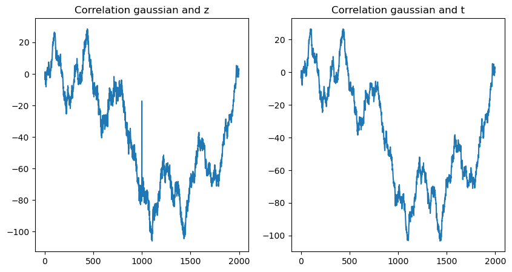
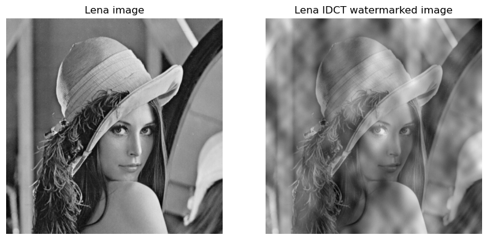
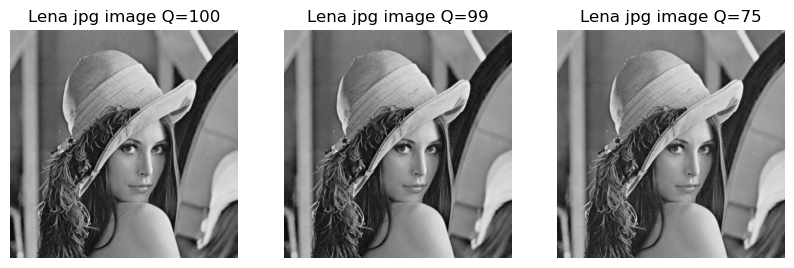

| Name       | Course  | Date       |
|------------|--------------|------------|
| Mélanie Brégou  | Digital content protection | 27/10/2023|

**Objective :** Implement a spread spectrum watermarking method, with a focus on utilizing off-the-shelf random number generators, understanding the principles of uniform and Gaussian distributed generators, exploring correlation functions, and applying these concepts towards CDMA-based watermarking.

### Table of Contents
- [Off-the-Shelf Random Number Generators](#off-the-shelf-random-number-generators)
  - [Principles](#principles)
  - [Uniform Distributed Generator](#uniform-distributed-generators)
  - [Gaussian Distributed Generator](###Gaussian-Distributed-Generators)
- [Correlation Functions](#correlation-functions)
  - [Graphical Representation and Properties](#graphical-representation-and-properties)
    - [Temporal Autocorrelation Function](#temporal-autocorrelation-function)
    - [Cross-Correlation Function](#cross-correlation-function)
  - [Towards CDMA](#towards-cdma)
    - [Study the robustness against noise addition](#study-the-robustness-against-noise-addition)
- [CDMA-Based Watermarking](#cdma-based-watermarking)


## Off-the-Shelf Random Number Generators 

### Principles


```python
import matplotlib.pyplot as plt
import random
import numpy as np
```

We define the LCG (linear congruential generator) function : xn = (a * xn-1 + b) mod c, 
- where a, b, c are positive integers 
- c can be a prime number,  a < c, b < c


```python
def LCG(x0,a,b,c):
    list = []
    x = x0
    for n in range(0,2*c):  
        list.append((a*x + b) % c)
        x= (a*x + b) % c
    return list

def Xn(x0,a,b,c,T):
    x1 = (a*x0 + b) % c
    return Xn(x1,a,b,c,T-1) if T>0 else x1
```

Let's generate a random sequence following the LCG rule, for the following parameters: a = 3, b = 5, c = 19 and x0 = 3


```python
plt.plot(LCG(x0=3,a=3,b=5,c=19))
plt.title("x0=3,a=3,b=5,c=19")
plt.show()
```


    

    


This parameter combination leads to repetitive sequences, resulting in patterns in the plot rather than true randomness. 


```python
fig, axes = plt.subplots(1, 4, figsize=(10, 5))
axes[0].plot(LCG(x0=7,a=3,b=5,c=19))
axes[0].set_title(f"x0=7,a=3,b=5,c=19")
axes[1].plot(LCG(x0=3,a=3,b=7,c=19))
axes[1].set_title(f"x0=3,a=3,b=7,c=19")
axes[2].plot(LCG(x0=3,a=7,b=5,c=19))
axes[2].set_title(f"x0=3,a=7,b=5,c=19")
axes[3].plot(LCG(x0=3,a=3,b=5,c=15))
axes[3].set_title(f"x0=3,a=3,b=5,c=15")
```


    Text(0.5, 1.0, 'x0=3,a=3,b=5,c=15')


    

    


Repeating the example for:
- c = 19, a = 3, b = 5, and x0 = 7
- c = 19, a = 3, b = 7, and x0 = 3
- c = 19, a = 7, b = 5, and x0 = 3
- c = 15, a = 3, b = 5, and x0 = 3

The generated plots are still repetitive sequences.

Now let's repeat the example for the MLCG (Multiple LCG), described by xn = (a * xn-1 + b * xn-2 + c) mod d, where a, b, c, d are positive integers and d can be a prime number,  a < d, b < d, c < d


```python
def MLCG(x0,x1, a,b,c,d):
    list = []
    xn = x0
    xn1 = x1

    for n in range(0,2*d):  
        list.append((a*xn1 + b*xn + c) % d)
        xn_ = xn
        xn = xn1
        xn1= (a*xn1 + b*xn_ + c) % d
    return list
```


```python
fig, axes = plt.subplots(1, 3, figsize=(10, 5))
axes[0].plot(MLCG(x0=7,x1=0,a=3,b=5,c=6,d=31))
axes[0].set_title(f"x0=7,x1=0,a=3,b=5,c=6,d=31")
axes[1].plot(MLCG(x0=3,x1=2,a=3,b=7,c=6,d=31))
axes[1].set_title(f"x0=3,x1=2,a=3,b=7,c=6,d=31")
axes[2].plot(MLCG(x0=3,x1=4,a=3,b=7,c=6,d=31))
axes[2].set_title(f"x0=3,x1=4,a=3,b=7,c=6,d=31")

```


    Text(0.5, 1.0, 'x0=3,x1=4,a=3,b=7,c=6,d=31')


    

    


The generated sequences do not seem repetitive and appear to be random.

### Uniform Distributed Generators


```python
def random_vector(T):
    return [random.uniform(0,1) for t in range(T)]

T=100
x = random_vector(T)
plt.plot(x)
plt.title(f"[0, 1] uniform generator with {T} components")
plt.show()

print("mean :",np.mean(x))
print("variance :",np.var(x))


plt.hist(x, 15, density=True)
plt.title(f"[0, 1] uniform generator with {T} components")
plt.show()
```


    

    


    mean : 0.523604935218904
    variance : 0.08380462274270617


    

    


The mean is approximately the theoretical mean of 0.5, which aligns with the uniform distribution in the range [0, 1]. The variance is also approximately as expected for a uniform distribution in [0, 1].
The more T is large the more uniform the sequence is.


```python
print("x:", x)
a= 1
b = 6
y1 = [a*xi + b for xi in x]
print("y1:",y1)

a= 6
b = 0
y2 = [a*xi + b for xi in x]
print("y2:",y2)


fig, axes = plt.subplots(1, 2, figsize=(10, 5))
axes[0].plot(y1)
axes[0].set_title(f"y = x + 6")
axes[1].plot(y2)
axes[1].set_title(f"y = 6x")

print("\nmean y = x + 6:",np.mean(y1))
print("variance y = x + 6:",np.var(y1))

print("\nmean y = 6x :",np.mean(y2))
print("variance y = 6x:",np.var(y2))

```

    x: [0.25837191659828673, 0.4470563921290477, 0.21382730728002808, 0.7086462073203836, 0.3705133398244411, 0.776530587035182, 0.6245249968295411, 0.6055792797378172, 0.20047566143197193, 0.7476917028832212, 0.007605557962887088, 0.6600414938252693, 0.7897935065863732, 0.8451555781774278, 0.46916100754285683, 0.29834856967908496, 0.15299829505332485, 0.7990704904514152, 0.7052788414120111, 0.43455085071476685, 0.41080882660183615, 0.8469856705920843, 0.17925364856258053, 0.597235407898144, 0.8894834971435803, 0.17677942597730867, 0.9017874629765549, 0.1391642452258447, 0.16908696917443422, 0.9687377617065794, 0.8558605812694794, 0.9672336228942946, 0.025345710253115716, 0.9368928428842539, 0.2841382877833384, 0.2676295593554707, 0.4483339344855558, 0.3112961811035514, 0.9842870866904126, 0.2429504222912039, 0.9534669885193416, 0.856102428315788, 0.11246021882927382, 0.6255693356389754, 0.0092892352608408, 0.3484323300025869, 0.5204459560633431, 0.4491732384806463, 0.7939177716387159, 0.6778219507997898, 0.25035108261802685, 0.6757293094523129, 0.3729853645172859, 0.17497848177504938, 0.7141314038388153, 0.9839656409272567, 0.6531845148593777, 0.4053919177857205, 0.9676795868041943, 0.3719787397880119, 0.3610795330975649, 0.4260508767361372, 0.27951603091395316, 0.04360423771126598, 0.785288125768064, 0.5039429430086181, 0.1382793843880049, 0.8461760019908358, 0.9147695729971356, 0.21423640538998656, 0.10539646167702355, 0.7953651908588297, 0.3264988721469524, 0.31319950539263697, 0.1657945694437255, 0.210725128993006, 0.6459855824939482, 0.610809529651901, 0.34482684476226844, 0.003863402465228094, 0.7105935752171066, 0.9348469122045779, 0.3340640165132659, 0.19298940842885515, 0.7449744847248124, 0.7317522404803241, 0.8992896601967665, 0.5586670660533961, 0.9212492669920598, 0.5922609334191495, 0.6794701791984561, 0.8624487424953742, 0.7555926452368393, 0.37518956356210553, 0.35120430225899457, 0.7273158434032417, 0.8574333485301392, 0.2783898505862623, 0.24347399882053722, 0.9383110604207417]
    y1: [6.2583719165982865, 6.447056392129047, 6.213827307280028, 6.708646207320384, 6.370513339824441, 6.776530587035182, 6.624524996829541, 6.6055792797378174, 6.200475661431972, 6.7476917028832215, 6.007605557962887, 6.660041493825269, 6.789793506586373, 6.845155578177428, 6.469161007542857, 6.298348569679085, 6.152998295053325, 6.799070490451415, 6.705278841412011, 6.434550850714767, 6.410808826601836, 6.846985670592084, 6.179253648562581, 6.597235407898144, 6.88948349714358, 6.176779425977308, 6.9017874629765545, 6.139164245225845, 6.169086969174434, 6.9687377617065795, 6.8558605812694795, 6.967233622894295, 6.025345710253116, 6.936892842884254, 6.284138287783338, 6.267629559355471, 6.4483339344855555, 6.311296181103551, 6.984287086690412, 6.242950422291204, 6.953466988519342, 6.856102428315788, 6.112460218829273, 6.625569335638976, 6.009289235260841, 6.348432330002587, 6.520445956063343, 6.449173238480646, 6.793917771638716, 6.67782195079979, 6.250351082618026, 6.675729309452313, 6.372985364517286, 6.1749784817750495, 6.714131403838815, 6.983965640927257, 6.653184514859378, 6.40539191778572, 6.967679586804194, 6.371978739788012, 6.3610795330975645, 6.426050876736137, 6.279516030913953, 6.043604237711266, 6.785288125768064, 6.503942943008618, 6.138279384388005, 6.846176001990836, 6.914769572997136, 6.214236405389986, 6.1053964616770235, 6.7953651908588295, 6.326498872146953, 6.313199505392637, 6.165794569443726, 6.210725128993006, 6.645985582493948, 6.610809529651901, 6.344826844762268, 6.003863402465228, 6.710593575217107, 6.934846912204578, 6.334064016513266, 6.192989408428855, 6.744974484724812, 6.731752240480324, 6.899289660196766, 6.558667066053396, 6.92124926699206, 6.5922609334191495, 6.679470179198456, 6.862448742495374, 6.755592645236839, 6.375189563562105, 6.351204302258995, 6.727315843403241, 6.857433348530139, 6.2783898505862625, 6.243473998820537, 6.938311060420742]
    y2: [1.5502314995897204, 2.682338352774286, 1.2829638436801685, 4.251877243922301, 2.2230800389466467, 4.659183522211092, 3.7471499809772464, 3.6334756784269033, 1.2028539685918316, 4.486150217299327, 0.04563334777732253, 3.960248962951616, 4.738761039518239, 5.070933469064567, 2.8149660452571412, 1.7900914180745098, 0.9179897703199491, 4.794422942708492, 4.231673048472067, 2.607305104288601, 2.464852959611017, 5.081914023552506, 1.0755218913754832, 3.5834124473888638, 5.336900982861482, 1.060676555863852, 5.410724777859329, 0.8349854713550682, 1.0145218150466053, 5.812426570239476, 5.135163487616876, 5.803401737365768, 0.1520742615186943, 5.621357057305524, 1.7048297267000303, 1.6057773561328244, 2.6900036069133346, 1.8677770866213084, 5.905722520142476, 1.4577025337472234, 5.72080193111605, 5.136614569894728, 0.6747613129756429, 3.753416013833853, 0.0557354115650448, 2.0905939800155213, 3.1226757363800584, 2.6950394308838774, 4.763506629832295, 4.066931704798739, 1.5021064957081611, 4.054375856713877, 2.2379121871037153, 1.0498708906502963, 4.284788423032892, 5.90379384556354, 3.919107089156266, 2.4323515067143227, 5.806077520825166, 2.2318724387280713, 2.1664771985853895, 2.5563052604168233, 1.677096185483719, 0.2616254262675959, 4.711728754608384, 3.0236576580517083, 0.8296763063280295, 5.0770560119450145, 5.488617437982813, 1.2854184323399194, 0.6323787700621413, 4.772191145152979, 1.9589932328817143, 1.8791970323558218, 0.994767416662353, 1.264350773958036, 3.8759134949636893, 3.664857177911406, 2.0689610685736106, 0.023180414791368564, 4.26356145130264, 5.609081473227468, 2.004384099079595, 1.1579364505731309, 4.469846908348875, 4.390513442881945, 5.395737961180599, 3.3520023963203767, 5.527495601952358, 3.5535656005148972, 4.076821075190736, 5.174692454972245, 4.533555871421036, 2.251137381372633, 2.1072258135539674, 4.36389506041945, 5.144600091180835, 1.6703391035175739, 1.4608439929232233, 5.62986636252445]
    
    mean y = x + 6: 6.523604935218902
    variance y = x + 6: 0.08380462274270613
    
    mean y = 6x : 3.141629611313425
    variance y = 6x: 3.016966418737421


    

    


On the left : 

We apply a linear transformation with 'a = 1' and 'b = 6' to the vector x. This transformation shifts all values in x by adding 6.

The plot shows that each value in x has been shifted.
- Mean is the expected mean of x + 6.
- Variance remains approximately the same as the variance of x.


On the right : 

We set 'a = 6' and 'b = 0', which effectively scale all values in x by a factor of 6.

The plot demonstrates that all values in x have been multiplied by 6, causing a uniform stretch of the distribution.

- Mean is approximately 6 times the mean of x.
- Variance is 6^2 times the variance of x.

### Gaussian Distributed Generators


```python
T= 100
gaussian = np.random.normal(0,0.1,T)

fig, axes = plt.subplots(1, 2, figsize=(10, 5))
axes[0].plot(gaussian)
axes[0].set_title("Gaussian Distribution Plot")

axes[1].hist(gaussian, 10, density=True)
axes[1].set_title("Histogram of Gaussian Distribution")

print("mean :",np.mean(gaussian))
print("variance :",np.var(gaussian))

```

    mean : 0.010568025096744142
    variance : 0.012131041665992786


    

    


In this Gaussian distribution, the mean is close to zero, and the variance reflects the spread of the data around this central point both indicative of the characteristics of a typical Gaussian distribution. With a larger T, the mean would likely converge even closer to zero.

##  Correlation Functions

In the domain of watermarking, autocorrelation functions are essential tools for quantifying the inherent randomness within a watermark and its correlation with the host signal. These functions are crucial for the security and resilience of embedded watermarks.


### Graphical Representation and Properties

#### Temporal Autocorrelation Function


```python
correlation = np.correlate(x,x,mode='full')

plt.plot(correlation)
plt.title("Correlation")
plt.show()
```


    

    


The central spike corresponds to the peak autocorrelation represents the self-similarity or self-correlation of the signal with itself when no time lag is introduced. This is a fundamental characteristic of any signal's autocorrelation function.


```python
x_1000 = random_vector(1000)
x_10000 = random_vector(10000)

correlation_1000 = np.correlate(x_1000,x_1000,mode='full')
correlation_10000 = np.correlate(x_10000,x_10000,mode='full')


fig, axes = plt.subplots(1, 2, figsize=(10, 5))
axes[0].plot(correlation_1000)
axes[0].set_title("Normal autocorrelation (1000)")
axes[1].plot(correlation_10000)
axes[1].set_title("Normal autocorrelation (10000)")

```


    Text(0.5, 1.0, 'Normal autocorrelation (10000)')


    

    


As the sample size T increase, the central spike becomes narrower and taller, and the random fluctuations become less pronounced. This is because with a larger sample size, the estimate of the autocorrelation becomes more precise and approaches the theoretical expectations.

 The random fluctuations away from the central spike suggest that the Gaussian signal is essentially uncorrelated with itself at different time lags.


### Cross Correlation Function


```python
gaussian_1000 = np.random.normal(0,0.1,1000)

a= 6
b = 16
z = [a*gauss+ b for gauss in gaussian_1000]
t = [a*gauss**2+ b for gauss in gaussian_1000]

correlation_y1 = np.correlate(z,z,mode='full')
correlation_y2 = np.correlate(t,t,mode='full')


fig, axes = plt.subplots(1, 2, figsize=(10, 5))
axes[0].plot(correlation_y1)
axes[0].set_title("Autocorrelation z = 6x + 16 ")
axes[1].plot(correlation_y2)
axes[1].set_title("Autocorrelation t = 6x**2 + 16 ")

```


    Text(0.5, 1.0, 'Autocorrelation t = 6x**2 + 16 ')


    

    


```python
correlation_gauss_z = np.correlate(gaussian_1000,z,mode='full')
correlation_gauss_t = np.correlate(gaussian_1000,t,mode='full')

fig, axes = plt.subplots(1, 2, figsize=(10, 5))
axes[0].plot(correlation_gauss_z)
axes[0].set_title("Correlation gaussian and z")
axes[1].plot(correlation_gauss_t)
axes[1].set_title("Correlation gaussian and t")
```


    Text(0.5, 1.0, 'Correlation gaussian and t')


    

    


### Towards CDMA

#### Study the robustness against noise addition

In this section, we explore the robustness of correlation functions in the context of Code Division Multiple Access (CDMA) as we examine their behavior in the presence of noise.


```python
T = 1000
alpha = 1
x_gauss_1 = np.random.normal(0,0.1,T)
x_gauss_2 = np.random.normal(0,0.1,T)
x_gauss_3 = np.random.normal(0,0.1,T)

correlation = np.correlate(x_gauss_1,x_gauss_2,mode='full')

plt.plot(correlation)
plt.title("Correlation")
plt.show()
```


    

    


The sets of Gaussian signals are largely uncorrelated.


```python
r1= [x_gauss_1[i] + alpha* x_gauss_3[i] for i in range(T)]
r2 = [x_gauss_1[i] + x_gauss_2[i] + alpha* x_gauss_3[i] for i in range(T)]

correlation_gauss_r_x1 = np.correlate(x_gauss_1,r1,mode='full')
correlation_gauss_r_x2 = np.correlate(x_gauss_2,r1,mode='full')
correlation_gauss_r2_x1 = np.correlate(x_gauss_1,r2,mode='full')
correlation_gauss_r2_x2 = np.correlate(x_gauss_2,r2,mode='full')

fig, axes = plt.subplots(2, 2, figsize=(20, 10))
axes[0][0].plot(correlation_gauss_r_x1)
axes[0][0].set_title("Correlation gaussian1 and r = gaussian1 + alpha * gaussian 3 ")
axes[0][1].plot(correlation_gauss_r_x2)
axes[0][1].set_title("Correlation gaussian2 and r")

axes[1][0].plot(correlation_gauss_r2_x1)
axes[1][0].set_title("Correlation gaussian1 and r2 = gaussian1 + gaussian2 + alpha * gaussian 3 ")
axes[1][1].plot(correlation_gauss_r2_x2)
axes[1][1].set_title("Correlation gaussian2 and r2  ")

fig.suptitle("Correlation with alpha = 1 and T = 1000", fontsize=30)

```


    Text(0.5, 0.98, 'Correlation with alpha = 1 and T = 1000')


    

    


On the up right there is no correlation.


```python
T = 1000
alpha = 1
x_gauss_1 = np.random.normal(0,0.1,T)
x_gauss_2 = np.random.normal(0,0.1,T)

r= [x_gauss_1[i] + alpha* x_gauss_2[i] for i in range(T)]

correlation_gauss_r = np.correlate(x_gauss_1,r,mode='full')

plt.plot(correlation_gauss_r)
plt.title("Correlation gauss (1000) and r = gauss1 + gauss2 ")
plt.show()
```


    

    


```python
fig, axes = plt.subplots(1, 3, figsize=(10, 5))
fig.suptitle("r = gauss1 + alpha * gauss2 with 1000 components", fontsize=14)

alphas = [2,8,64]
for i, alpha in enumerate(alphas): 
    r= [x_gauss_1[i] + alpha* x_gauss_2[i] for i in range(T)]

    correlation_gauss_r = np.correlate(x_gauss_1,r,mode='full')
    axes[i].plot(correlation_gauss_r)
    axes[i].set_title(f"alpha = {alpha}")

```


    

    


```python

x_gauss_1_100000 = np.random.normal(0, 0.1, 100000)
x_gauss_2_100000 = np.random.normal(0, 0.1, 100000)


T = 100000
r_gauss_100000 = [x_gauss_1_100000[j] + alpha * x_gauss_2_100000[j] for j in range(T)]
fig2, axes2 = plt.subplots(1, 3, figsize=(10, 5))
fig2.suptitle("r = gauss1 + alpha * gauss2 with 100000 components", fontsize=14)

for i, alpha in enumerate(alphas):
    

    correlation_gauss_r_100000 = np.correlate(x_gauss_1, r_gauss_100000, mode='full')
    axes2[i].plot(correlation_gauss_r_100000)
    axes2[i].set_title(f"{alpha}")

```


    

    


The higher the alpha and the number of samples (T), the noisier the autocorrelation.

## CDMA based watermarking


```python
import cv2
```

Firstly let's compute the DCT transform.


```python
lena = cv2.imread("../TP-HTI/lena.jpg", 0)
lena_f = np.float32(lena)
dct_lena = cv2.dct(lena_f)

idct_lena = cv2.idct(dct_lena)
idct_lena = np.uint8(idct_lena)

fig, axes = plt.subplots(1, 2, figsize=(10, 5))
axes[0].imshow(lena, cmap='gray')
axes[0].set_title("Lena image")
axes[1].imshow(idct_lena, cmap='gray')
axes[1].set_title("Lena IDCT image")

for ax in axes:
    ax.axis('off')
```


    

    


The image obtained after IDCT is identical.

Now before applying IDCT, we generate a mark: a standard Gaussian noise sequence of 32x32 valus with m(1,1) = 0 and insert the mark according to the formula: niu_w = niu*(1+ alpha*m) where alpha is a scalar.


```python
alpha = 1
niu = dct_lena[:32,:32]
m = np.random.normal(0, 1, (32, 32))
niu_w = niu*(1+ alpha*m)

fig, axes = plt.subplots(1, 2, figsize=(10, 5))
axes[0].imshow(niu, cmap='gray')
axes[0].set_title("niu")

axes[1].imshow(niu_w, cmap='gray')
axes[1].set_title("niu_w")
```


    Text(0.5, 1.0, 'niu_w')


    

    


Then, we perform the IDCT transform on the watermarked image.


```python
dct_lena[:32,:32] =  niu_w
dct_lena[0,0] = niu[0,0]

idct_lena = cv2.idct(dct_lena)

fig, axes = plt.subplots(1, 2, figsize=(10, 5))
axes[0].imshow(lena, cmap='gray')
axes[0].set_title("Lena image")

axes[1].imshow(idct_lena, cmap='gray')
axes[1].set_title("Lena IDCT watermarked image")
for ax in axes:
    ax.axis('off')

```


    

    


With a value alpha=0.1 the PSNR is small. In order to have high image quality, let's write a function so that PSNR(lena, lena_mark) > 30 dB.


```python
def watermark_lena(alpha):
    lena = cv2.imread("../TP-HTI/lena.jpg", 0)
    lena_f = np.float32(lena)
    dct_lena = cv2.dct(lena_f)
    niu = dct_lena[:32,:32]
    m = np.random.normal(0, 1, (32, 32))
    niu_w = niu*(1+ alpha*m)
    dct_lena[:32,:32] =  niu_w
    dct_lena[0,0] = niu[0,0]
    idct_lena = cv2.idct(dct_lena)
    return idct_lena, m 
    
alpha = 1
idct_lena_w, m = watermark_lena(alpha)
lena = np.float32(lena)
psnr = cv2.PSNR(idct_lena, lena)

while psnr < 30 :
    alpha = alpha/10
    idct_lena_w,m = watermark_lena(alpha)
    psnr = cv2.PSNR(idct_lena_w, lena)

print("PSNR final",psnr)
print("Alpha final",alpha)

fig, axes = plt.subplots(1, 2, figsize=(10, 5))
axes[0].imshow(lena, cmap='gray')
axes[0].set_title("Lena image")

axes[1].imshow(idct_lena_w, cmap='gray')
axes[1].set_title("Lena IDCT watermarked image")

for ax in axes:
    ax.axis('off')

```

    PSNR final 46.59884513165156
    Alpha final 0.01


    

    


The watermark is now imperceptible.

#### Detection step


```python
def watermark_detection(lena,idct_lena_w, m, threshold=0.5):
    idct_lena_w_f = np.float32(idct_lena_w)
    dct_lena = cv2.dct(idct_lena_w_f)
    niu_w  = dct_lena[:32,:32]
    
    niu = niu_w/(1+ alpha*m)
    dct_lena[:32,:32] =  niu
    dct_lena[0,0] = niu[0,0]
    idct_lena = cv2.idct(dct_lena)
    h, w = lena.shape
    diff = cv2.subtract(lena, idct_lena)
    err = np.sum(diff**2)
    mse = err/(float(h*w))

    if mse < threshold:
        return "Detected", mse
    else:
        return "Not Detected", mse

```


```python
print(watermark_detection(lena,idct_lena_w, m ))
```

    ('Detected', 1.0668644856437481e-09)


The mean squared error between Lena and the image, from which we removed the watermark 'm' from its DCT, is almost 0, which is as expected, since this image is the one to which we added the watermark.

#### Robusteness to jpeg compression


```python
from PIL import Image
from matplotlib import image
```

Firstly, let's save the watermarked in jpg with different quality factors (100, 99 and 75).


```python
idct_lena_w = Image.fromarray(idct_lena_w)
idct_lena_w = idct_lena_w.convert("L")
idct_lena_w.save(f'./results/lena_w{alpha}_100.jpg', optimize=True, quality=100)
idct_lena_w.save(f'./results/lena_w{alpha}_99.jpg', optimize=True, quality=99)
idct_lena_w.save(f'./results/lena_w{alpha}_75.jpg', optimize=True, quality=75)
```


```python
lena_w_100 = image.imread(f"./results/lena_w{alpha}_100.jpg")
lena_w_99 = image.imread(f"./results/lena_w{alpha}_99.jpg")
lena_w_75 = image.imread(f"./results/lena_w{alpha}_75.jpg")

fig, axes = plt.subplots(1, 3, figsize=(10, 5))
axes[0].imshow(lena_w_100, cmap='gray')
axes[0].set_title(f"Lena jpg image Q=100")
axes[1].imshow(lena_w_99, cmap='gray')
axes[1].set_title(f"Lena jpg image Q=99")
axes[2].imshow(lena_w_75, cmap='gray')
axes[2].set_title(f"Lena jpg image Q=75")

print(watermark_detection(lena,lena_w_100, m ))
print(watermark_detection(lena,lena_w_99, m ))
print(watermark_detection(lena,lena_w_75, m ))

for ax in axes:
    ax.axis('off')
```

    ('Detected', 0.3582899868488312)
    ('Detected', 0.37200385332107544)
    ('Not Detected', 10.26805305480957)


    

    


Even if the visual difference is imperceptible, the watermark may not be detected based on the threshold we select, particularly for lower quality images.
